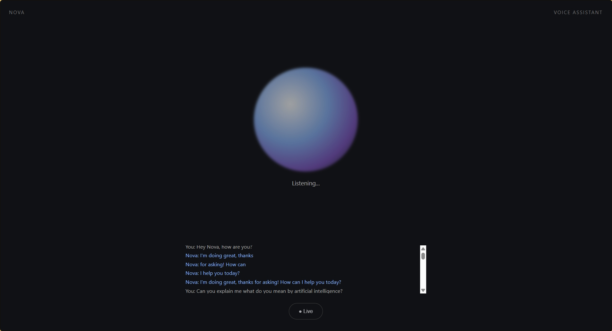

# 🤖 Nova – Real-Time AI Voice Assistant

Nova is a real-time AI voice assistant that allows users to have natural voice conversations with an AI directly through a web browser.

The project uses **Google ADK** and the **Gemini Live API** to process live audio, generate AI responses, and stream voice responses back to the user.

## ✨ Features

- 🎙️ Real-time voice conversation
- 🧠 Gemini-powered AI responses
- 🔊 Real-time AI voice output
- 💬 Live conversation transcripts
- ⚡ WebSocket-based real-time communication
- 🛑 Voice interruption / barge-in support
- 🌐 Browser-based interface
- 🔐 API key protected using environment variables

## 🛠️ Technologies Used

- **Python 3.11**
- **Google ADK**
- **Gemini Live API**
- **FastAPI**
- **WebSocket**
- **JavaScript**
- **HTML**
- **CSS**
- **uv**

## 🏗️ Project Architecture

```text
🎙️ User Microphone
        ↓
🌐 Browser
        ↓
🔌 WebSocket
        ↓
🐍 FastAPI Server
        ↓
🤖 Google ADK
        ↓
🧠 Gemini Live API
        ↓
🔊 AI Audio Response
        ↓
🌐 Browser
        ↓
🔈 User Speaker

## 📸 Project Demo

Here is Nova running in the browser:

